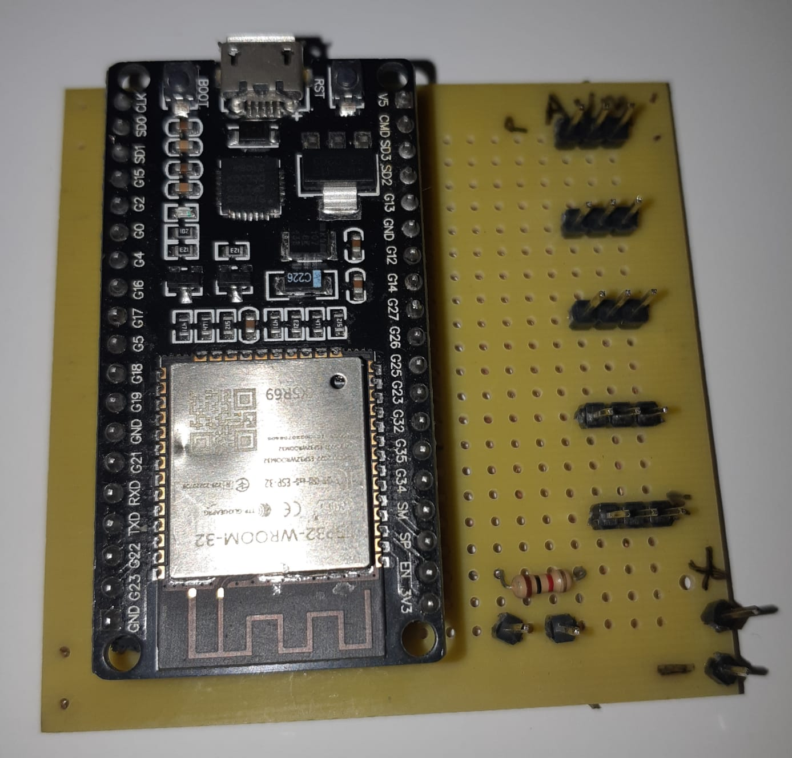
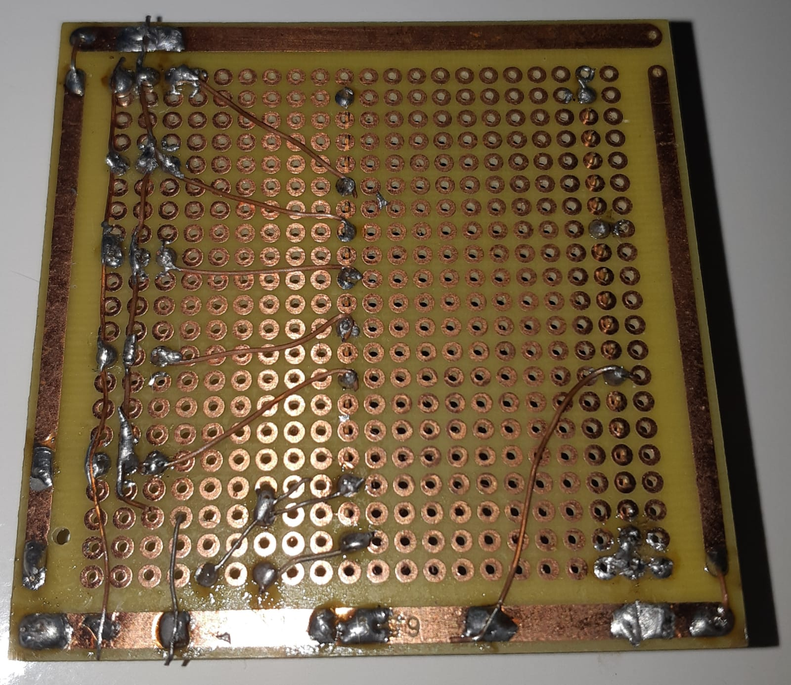

# Circuito Eletrônico da Mão

Foi desenvolvido um circuito em Placa Perfurada para conectar a fonte aos motores e os pinos de controle do ESP32 nos motores. Além do divisor de tensão do Sensor de Pressão. Como pode ser visto abaixo:

Os motores utilizados foram MG996R e o Sensor de Pressão foi o PFG FSR400.

## Diagrama do Circuito

    

## Circuito Desenvolvido

    
    

